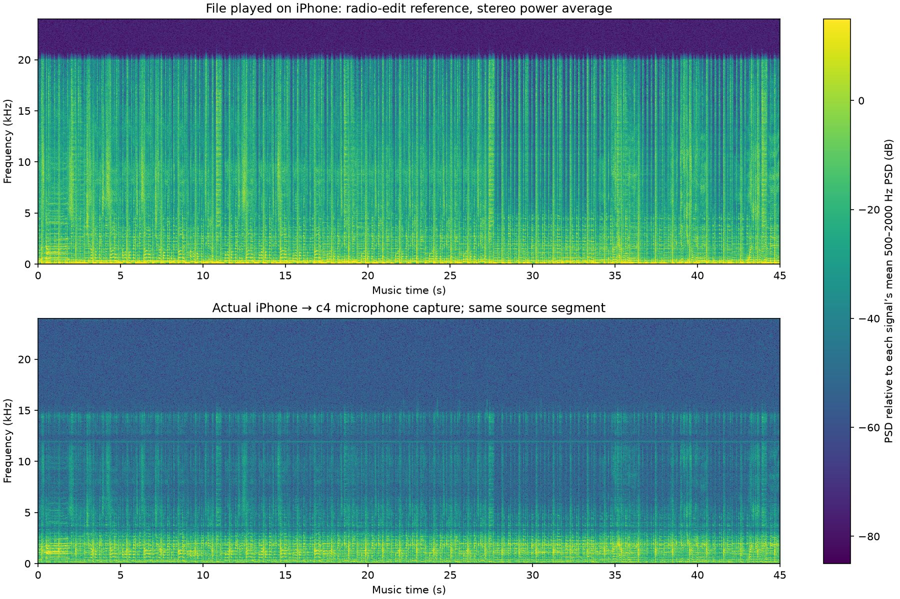
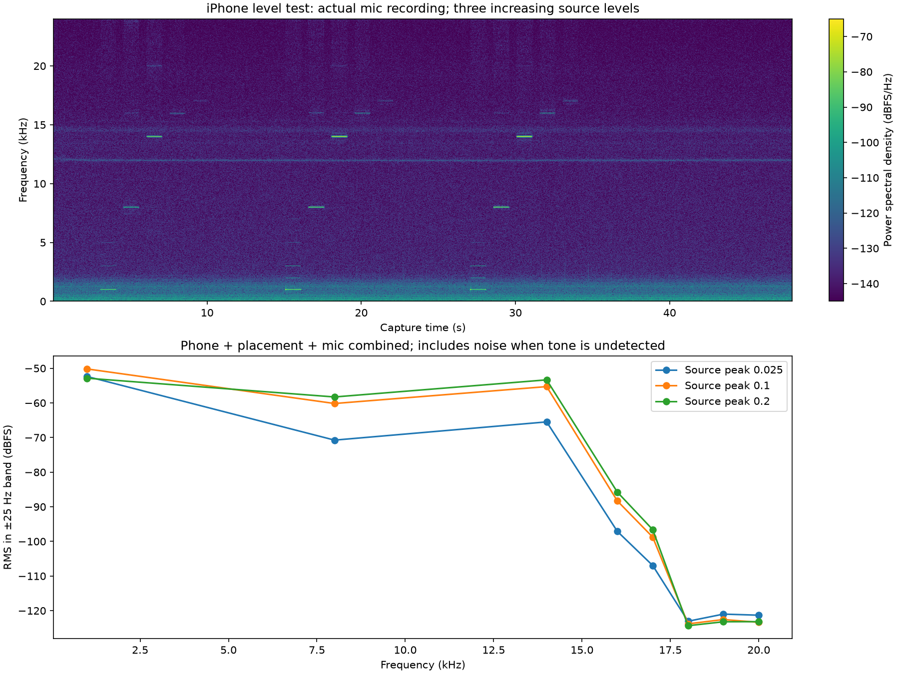

# Action-camera repeat

Repeated the existing music and three-level tone sequence after the user confirmed readiness to film. Each recording was preceded by on-device TTS/countdown. Source files and firmware were unchanged; this is not a new quality fix.

The music capture lasted 58 seconds (45 seconds of music plus margins) and the tone capture lasted 48 seconds. Both had zero input overruns. Music/source envelope correlation was 0.902. The 16–18 and 18–20 kHz music band powers were 0.63 and 1.16 dB above the post-music noise interval. The strongest test level still detected 16–17 kHz but did not robustly detect 18–20 kHz.

This repeats the previous combined phone/placement/microphone finding; it does not isolate the microphone or enclosure. The action camera's own audio was not supplied or analyzed. No further playback or captures were started after these two tests.

[Numeric results](metrics/phone-camera-repeat.json)
