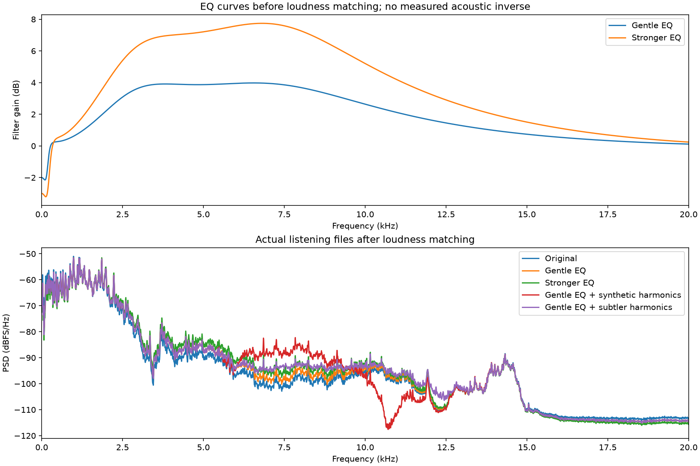

# Offline clarity EQ and harmonic audition

At the user's request, made listening variants from the better iPhone-to-comma-four capture (`phone-music-camera-01`), using the same aligned 45 seconds for every version. No new recording, firmware modification, or reference-song mixing was performed. The user prefers the iPhone as the source for further physical tests.

Variants:

- Original: playback gain only.
- Gentle EQ: -2 dB low shelf at 200 Hz, broad +3 dB peaks at 3.2 and 7.5 kHz. Combined boost is roughly 4 dB in the overlapping region.
- Stronger EQ: -3 dB low shelf at 250 Hz, broad +5/+6 dB peaks at 3.2/7.5 kHz. Combined boost approaches 8 dB.
- Gentle EQ plus synthetic harmonics: the prior brighter version, with an oversampled nonlinear branch shaped mainly to 7–12 kHz. Wet RMS is 28 dB below the EQ signal's whole-clip RMS.
- Gentle EQ plus subtler harmonics: reduces the added layer to 34 dB below dry RMS (6 dB less than the prior option), and derives it from an input band confined mainly to 2.5–4.5 kHz. The EQ bass cleanup is unchanged. This adds invented content; it does not recover the original missing frequencies. FIR processing is centered offline; real-time latency/CPU suitability is unvalidated.

EQ choices are restrained taste experiments based on where the iPhone capture still has musical content, not an inverse response calibrated against the downloaded reference. EQ raises noise along with signal. The harmonic option can alter timbre, add harshness or intermodulation, and is not established as higher fidelity. No denoising is used.

All five encoded WAVs measure approximately -25.70 LUFS with about 3 dB or more true-peak headroom. Matching uses constant gain only; no limiter or compressor. A pure 3 kHz probe verifies that the nonlinear path generates a 9 kHz component. Browser checks verified all five buttons, retained playback position when switching, 45-second durations, and restart, with audio muted during testing.

The report is self-contained, with synchronized switching buttons and embedded audio/plot. User feedback: both EQ versions improved the sound and reduced boomy bass. The prior synthetic version was interesting but airy/shallow and made vocals sound too high-pitched. The subtler option responds to this feedback; its preference is pending. These measurements verify processing and headroom, not general perceptual improvement.

Methods: [RBJ/W3C EQ cookbook](https://www.w3.org/TR/audio-eq-cookbook/) and [FFmpeg exciter documentation](https://ffmpeg.org/ffmpeg-filters.html#aexciter).

[Embedded listening report](reports/clarity-comparison.html) · [Processing measurements](metrics/clarity-comparison.json)
