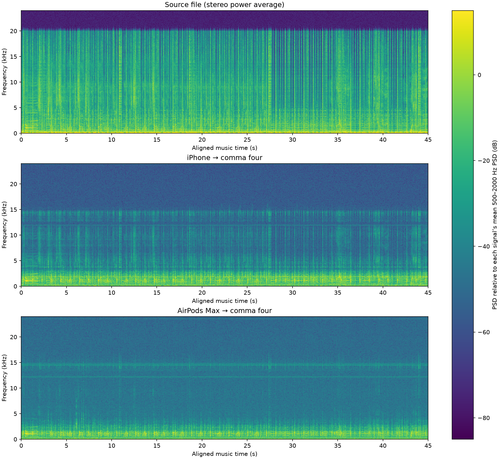
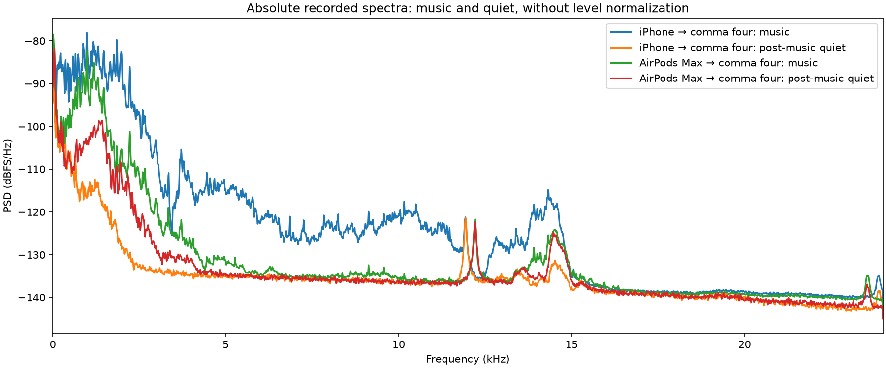

# Music through USB AirPods Max

At the user's request, played the exact stereo music file from the action-camera iPhone test through USB AirPods Max. The comma four announced a spoken countdown, then captured 58 seconds at native 48 kHz, including 45 seconds of music and quiet margins. Same pop-fix firmware, no EQ or denoising. The initial earcup placement was near the USB corner of the flat device; PC sink volume read 100% and was not changed by the controller. Music file peak was 0.2 full scale.

The user reported moving the AirPods; whether this happened between tests, during music, or both is not yet established. Placement was not controlled, so the weaker music result cannot be compared with the tone test as a fixed-position measurement.

Playback was verified by temporal music-envelope alignment (correlation 0.927). The capture had zero input overruns/underruns and zero samples at integer rails; whole-recording peak was -34.4 dBFS.

This recording did not improve the recovered high-frequency music; movement prevents a fixed-position comparison with the tone run. The AirPods capture's 4–8 and 8–12 kHz bands were only 1.95 and 0.95 dB above the post-music quiet interval, versus 17.47 and 11.47 dB in the earlier iPhone capture. Its 16–18 and 18–20 kHz bands were 0.63 and 0.77 dB above quiet. The 500–2000 Hz music band was also 7.24 dB lower in absolute level than the earlier iPhone capture. Post-music room noise differed, so these are descriptive band comparisons, not calibrated SNR measurements.

The previous isolated-tone capture still establishes detection through 22 kHz. Strong isolated tones and weaker high-frequency music can give different visibility above the noise floor. Neither experiment isolates the microphone response from speaker output, placement, stereo coupling, and enclosure effects. This does not resolve the remaining muffled quality or demonstrate a hard cutoff.

The report contains the source, earlier iPhone capture, and new AirPods capture, aligned to the same 45 seconds. Listening copies use constant gain only, targeting -24 dBFS RMS with peak headroom (iPhone achieved -24.13 dBFS). Spectrograms instead normalize each signal's mean 500–2000 Hz PSD. Raw recordings are preserved locally.

[Embedded listening report](reports/headphone-music.html) · [Measured values](metrics/headphone-music.json)
