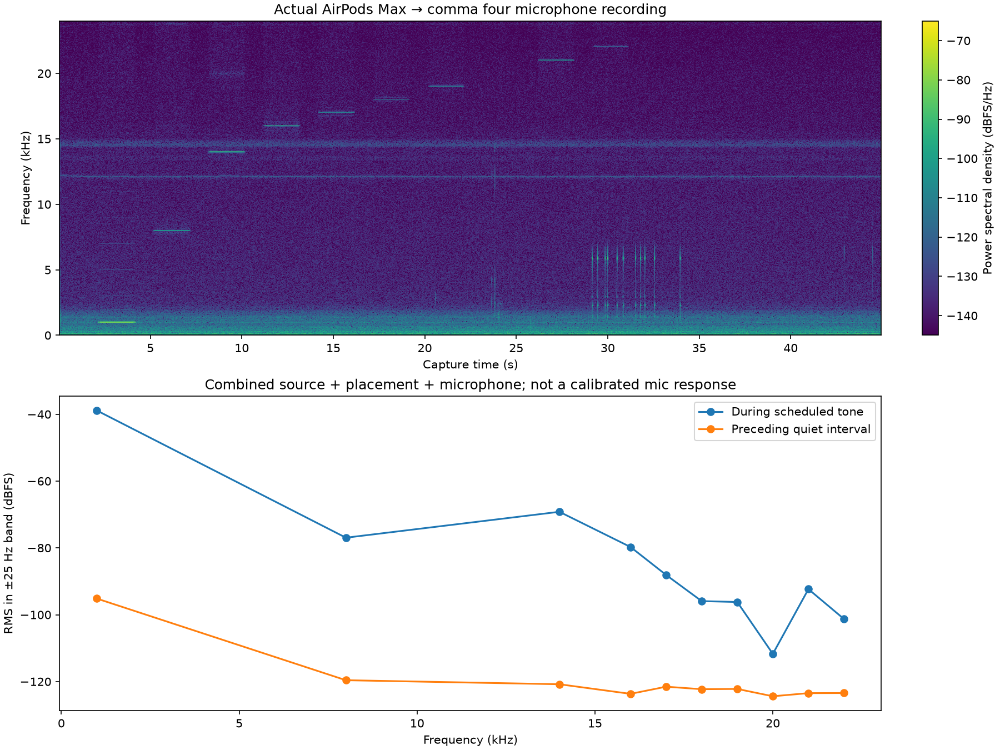
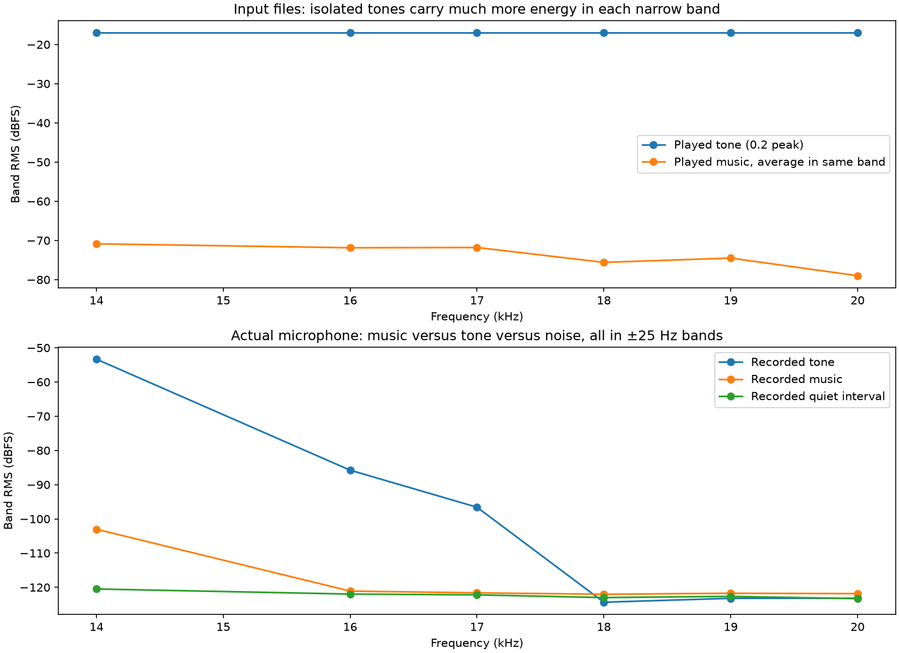

# Independent USB headphone source

After placement/readiness confirmation and an on-device spoken countdown, USB AirPods Max played a 35-second file containing spaced 2-second tones from 1 to 22 kHz. The comma four recorded 45 seconds at native 48 kHz using the existing pop-fix firmware. Its output carried digital silence during capture to maintain audio clocks. No microphone EQ, denoising, gain, or firmware change was made.

The open earcup was close to the USB corner of the flat device, without an acoustic seal. Both source channels were identical, with 0.1 full-scale peak. PC sink volume read 100% at capture time; the controller did not change it. This is an uncalibrated external speaker and placement.

The capture detected the scheduled tones through 22 kHz. In bands within 25 Hz of each test frequency, 18/19/20/21/22 kHz rose 26.4/26.0/12.7/31.1/22.2 dB above their preceding quiet intervals. Spectral peaks were within 5 Hz of all commanded frequencies. Capture had zero input overruns, input underruns, output underruns, or samples at the integer rails; whole-recording peak was -34.9 dBFS.

This rules out a hard 15–18 kHz cutoff in the tested capture path. The previous iPhone non-detection at 18–20 kHz cannot establish a hard microphone cutoff; the source and placement matter. The dip at 20 kHz is not yet attributable to the mic, headphones, or acoustic geometry. This does not establish flat microphone response or solve the remaining muffled music quality.

No further recording or playback was started after this test.

[Measured values](metrics/headphone-source.json) · [Self-contained listening report](reports/headphone-source.html)

## Why a faint tone can appear where music looks absent

In the action-camera iPhone repeat, the played 16–17 kHz tones carry about 55 dB more digital energy than the music in the same narrow band. Recorded music there was less than 1 dB above the quiet interval, while the tones remained visible. This explains why visibility of tone lines and music can differ without a bandwidth mode change. Source music is stereo mean power; this is not a calibrated acoustic transfer function.

