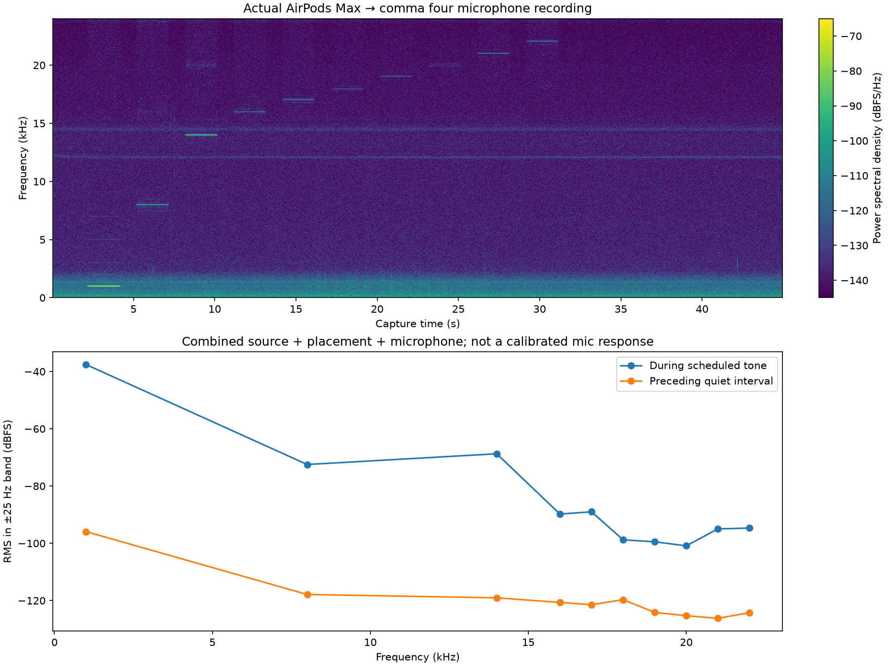
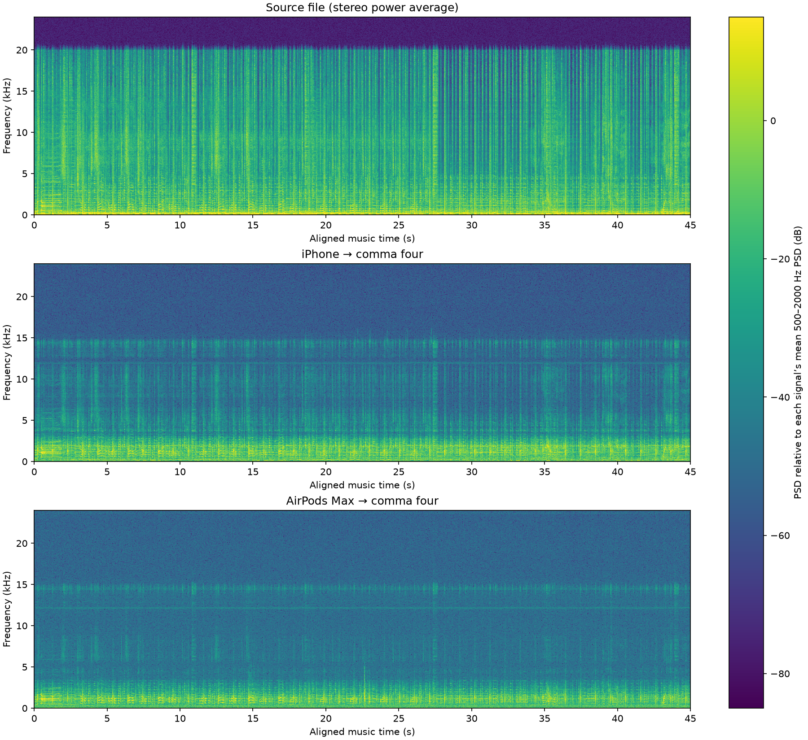
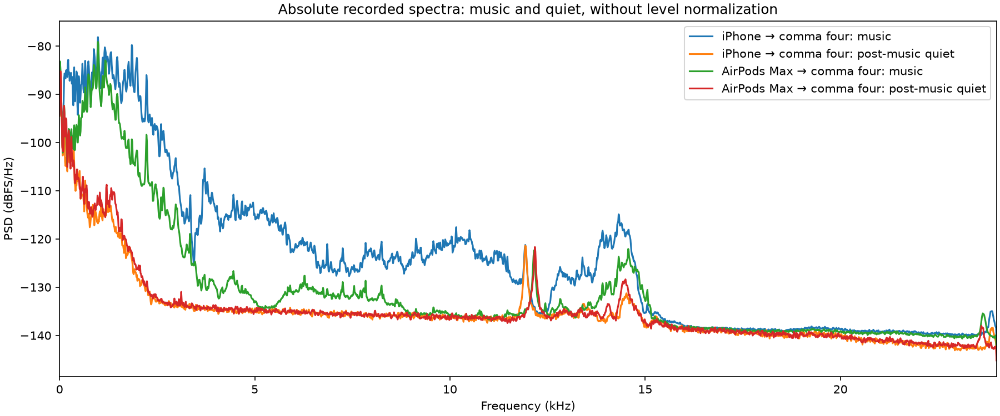

# Stationary AirPods tone and music repeat

After the user reported moving the headphones to hear the earlier tones, they confirmed the headphones were stationary. Repeated the 45-second tone capture followed by a 58-second music capture, asking that the earcup stay in place throughout. Each capture had its own full-volume spoken countdown on comma four, and the final announcement explicitly ended the pair. No further playback was scheduled.

Both source files were byte-identical to the previous tests. USB sink volume was unchanged at 100% for both runs; tone file peak was 0.1 and music peak was 0.2. Same native 48 kHz capture and pop-fix firmware, without EQ or denoising. The setup remains an uncalibrated headphone, air path, enclosure and microphone combination; physical stationarity was user-confirmed, not instrumented.

The fresh tone recording detected all scheduled frequencies through 22 kHz. At 20/21/22 kHz, band power rose 24.4/31.2/29.6 dB above the preceding quiet interval. At 20 kHz this is stronger than the previous run, which had a 12.7 dB rise. This supports the earlier conclusion that the capture path has no hard 15–18 kHz cutoff, while showing why the prior moving setup cannot establish a fixed frequency response.

Music/source envelope correlation was 0.939. Input overruns: tones 0, music 0. Samples at integer rails: tones 0, music 0.

| Music band (kHz) | Above post-music quiet (dB) | Absolute change from prior moved run (dB) |
|---|---:|---:|
| 0.5–2 | 23.69 | +2.55 |
| 4–8 | 3.97 | +1.80 |
| 8–12 | 1.24 | +0.38 |
| 12–14 | 0.76 | -0.20 |
| 14–16 | 5.33 | +0.79 |
| 16–18 | 0.39 | -0.22 |
| 18–20 | 0.79 | +0.01 |
| 20–22 | 1.45 | +0.10 |

Band increases are descriptive, not calibrated SNR or proof of recovered music; changed room noise and narrow interferers can contribute. The report shows source, earlier iPhone, and new stationary AirPods music with common spectrogram scales and listening copies matched to -28 dBFS RMS. Only constant gain is applied to listening copies; original captures are retained. Strong tone detection alone does not establish audibly useful high-frequency music or flat microphone response.

[Embedded listening report](reports/headphone-stationary.html) · [Measurements](metrics/headphone-stationary.json)
