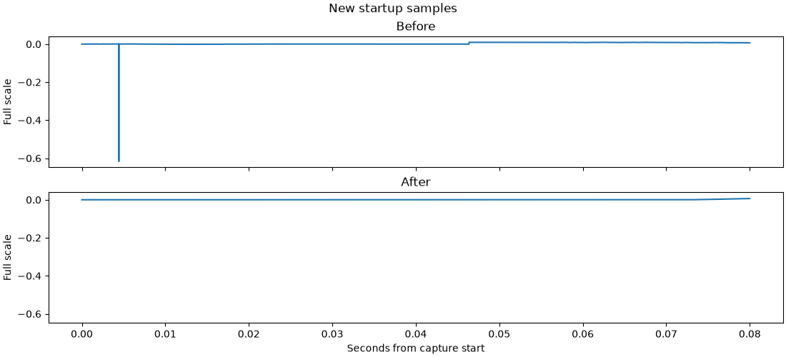
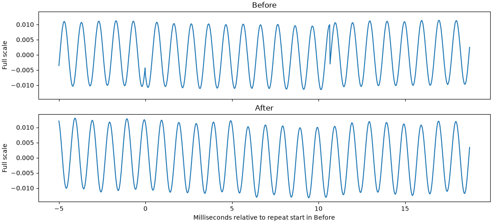
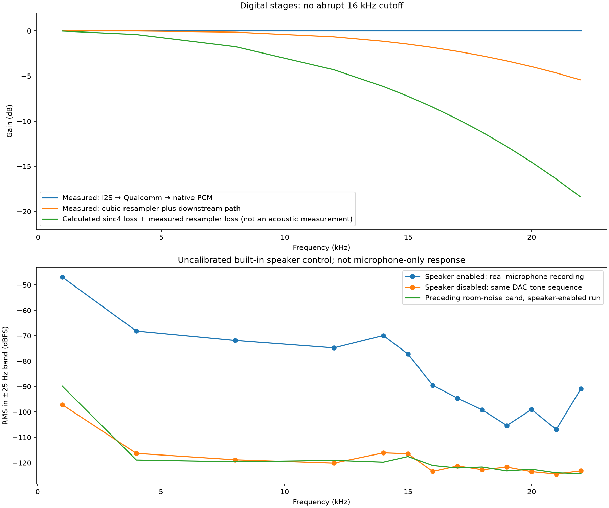
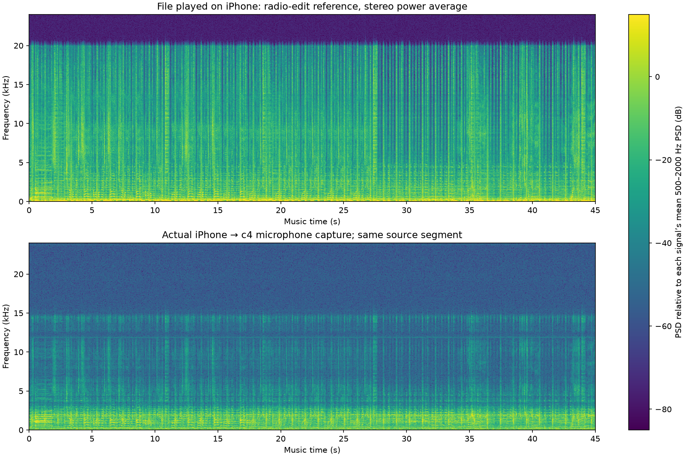
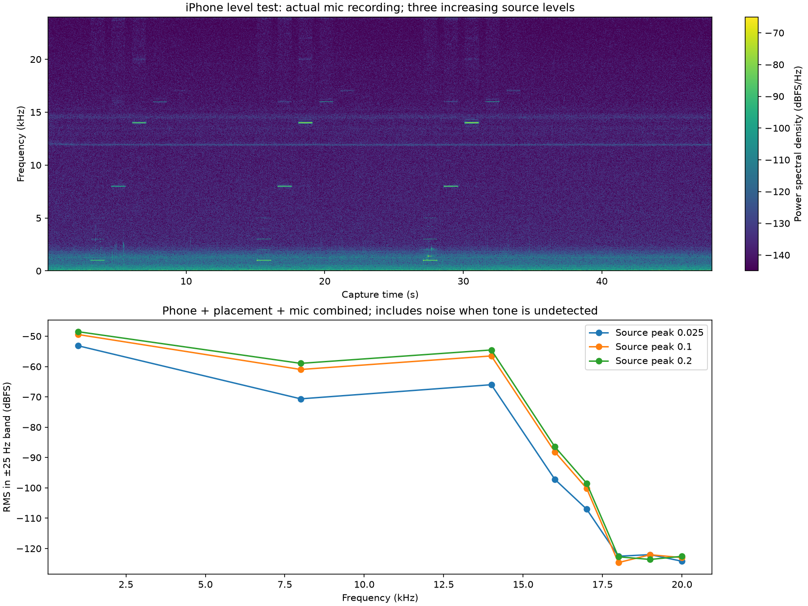

# Comma four microphone hackathon investigation

This is a work-in-progress notebook and firmware candidate. Two digital defects are reproduced and addressed: stale microphone output memory at startup, and repeated blocks caused by independent input/output clocks. The muffled sound and missing upper-frequency music content are still being investigated. The user's original driving/motion symptom has not been reproduced under normal on-road workload.

## What changed

The microphone path is PDM → STM32H7 DFSDM sinc4 decimator → circular DMA → SAI/I2S → Qualcomm/ALSA → openpilot micd → logged audio. The configured input rate is 240 MHz / 91 / 55 = 47,952.048 samples/s; the outgoing I2S is nominally 48 kHz. Copying whole input blocks into output buffers without rate matching repeated 512 samples about every 10.53 seconds in baseline native recordings.

The firmware now clears microphone output buffers before use and after idle, fills output on its own DMA completion interrupt, and reads the input ring at a continuously corrected fractional rate. It uses cubic interpolation, saturation and a one-block startup fade. The original microphone clock/filter settings and gain are retained.

The microphone output buffers live in SRAM4, outside normal startup BSS clearing. The baseline had a reproducible -20207/32768 startup sample; initialization removed that artifact. Startup handling and continuous clock matching address different defects.

## Actual before/after evidence

The fresh 15-second baseline capture contains an exact 512-sample repeat at 10.521 seconds. The candidate capture contains none. Both are real recordings, with different room sound; quieter ambient noise is not a measured microphone improvement.

Download and open [the self-contained before/after listening report](reports/pop-comparison.html). Audio is embedded. This is an acoustic recording of the room and test speaker, not a calibrated microphone specification.

## Validation so far

- Baseline: three exact 512-sample repeats in a 40-second native capture, no capture overruns. Changing just the nominal clock divider failed a longer test and is not the proposed fix.
- Final algorithm, fresh-reset instrumented 300-second run: 28,127 output blocks, no re-centering, exact repeated runs, capture overruns or near-rail samples. Buffer occupancy 700–767 samples; maximum measured mic IRQ time 531 microseconds versus a 10.67 ms output-block interval.
- Final uninstrumented firmware through real micd/loggerd under a CPU-only workload: 1,200 messages / 960,000 samples matched the rlog PCM byte-for-byte, with zero input overruns.
- The actual C handler passed host simulation with UndefinedBehaviorSanitizer at input clock offsets from -2000 to +2000 ppm with position jitter. Saved ARM build and intended MISRA checks passed on the final firmware candidate.
- These are desk tests. Full CAN/camera/model workload, confirmed device-motion reproduction, end-to-end A/V latency, and the separate speaker-start squeak remain open.

## Frequency-response investigation

Normal micd capture is 16 kHz mono; that limits recorded bandwidth to below 8 kHz. With audio recording enabled, PCM is in rlog, not qlog. Video audio uses mono AAC at 32 kbit/s. The native tests here capture 48 kHz PCM before those sample-rate/codec reductions. Listened comparisons favored native 48 kHz and 48 kHz AAC over the 16 kHz versions. No 48 kHz production logging change is included yet.

Digital injection immediately before I2S transported 528,000 consecutive samples exactly, including tones through 22 kHz. A separate injection through the actual cubic interpolator measured gradual loss: about 1.8 dB at 16 kHz and 4 dB at 20 kHz. Those are explicitly synthetic diagnostic inputs, not fabricated microphone recordings. The temporary diagnostic firmware was restored afterward. The cubic interpolator also has measured upper-band residual distortion; it is not transparent at high frequencies. Alternative interpolation remains an open improvement.

The configured sinc4 filter adds calculated gradual loss (roughly 6.6 dB at 16 kHz and 10.6 dB at 20 kHz). The injection tests bypassed that filter and the physical microphone; they do not measure microphone sensitivity.

**Different source experiments must stay separate:**

- The built-in comma four speaker produced detectable 16–22 kHz components in the mic capture. With its amplifier disabled but the same DAC sequence running, those components fell to the noise floor. This demonstrates dependence on the enabled speaker/amplifier; it does not fully separate airborne sound, mechanical coupling or amplifier interference.
- The external iPhone sweep detected 16 and 17 kHz. It did not robustly recover 18–20 kHz. Its geometry and coupling differ from the built-in speaker.
- The earlier music used Spotify on the iPhone. The new automated music test used an existing downloaded studio radio-edit reference through the same native browser audio element as the tones. These are not identical source streams/apps.

Download [the stage-isolation report](reports/upper-frequency.html) for the measurements and original-level external-phone recording.

## Latest controlled phone music and level tests

The phone remained at its reported approximately 60% physical volume setting. The controller played 45 seconds of the reference music at 0.2 full-scale peak, then tones at digital peaks 0.025, 0.1 and 0.2. Every capture had a spoken device countdown. All three new captures (repeat sweep, music, level test) had zero capture overruns.

The music temporal envelope matched the selected source segment with correlation 0.899. Its 16–18 and 18–20 kHz band powers were only 0.34 and 0.68 dB above the post-music noise window, respectively. Energy above noise alone is not proof of intelligible musical content.

Increasing the tone file amplitude from 0.1 to 0.2 is +6.02 dB digitally, but the recorded 8, 14, 16 and 17 kHz bands rose only about 1.7–2.0 dB. The 18–20 kHz bands remained near the noise floor. That is evidence of compression/nonlinearity somewhere in this combined source/capture setup, not a calibrated microphone-only response or proof of which component is responsible.

Download [the music/level listening report](reports/phone-music-and-levels.html): the exact played source, actual recordings and plots are embedded. Playback levels are not perceptually loudness-matched.

The package can be rigidly mounted while its internal diaphragm responds to air pressure. The case port, gasket/cavity and mesh can affect the acoustic response; [Knowles' design guide](https://www.knowles.com/docs/default-source/default-document-library/sisonic-design-guide.pdf) describes these effects. Enclosure loss is plausible but unisolated here. An independent wideband reference microphone or independently measured external source is the next strong discriminator. EQ fitted to one song should not be treated as hardware calibration.

## Tools, provenance and unfinished experiments

[Hackathon tools](../../tools/mic_debug/README.md) include native capture/metrics, actual micd/logger checks, interpolation checks, local listening/status displays, phone playback with keep-awake, and report scripts. They depend on an openpilot environment; session scripts retain local paths and require adaptation before use elsewhere. They are not part of the firmware build.

[Metrics](metrics/) contain the plotted numeric results. The listening HTML files contain only embedded assets, with private device/browser metadata excluded. Raw callbacks, firmware binaries and the full local experiment archive remain preserved in the local worktrees; they are not required to view these reports.

The first Web Audio phone attempt acknowledged playback but emitted no detected tones and is excluded. The first resampler injection experiment mixed synthetic and live DMA samples; its plot under `figures/resampler-path-01` is invalid for gain calibration and superseded by `resampler-path-02`. It is retained as an explicitly rejected experiment. Mild denoising changed timbre without a clear listening preference; the modest treble compensation produced no meaningful improvement. Neither was installed as a fix.

All additional figures are indexed in [the plot gallery](PLOTS.md).

## Action-camera repeat

The user filmed a repeat of the automated music and tone sequence. Both captures completed without overruns and reproduced the weak upper-band result. [Repeat measurements and plots](ACTION-CAMERA-REPEAT.md). No firmware or audio-processing change was made for the demonstration.

## Independent headphone source: tones through 22 kHz

An external USB AirPods Max test detected scheduled tones through 22 kHz, including a weak 20 kHz tone. This rules out a hard 15–18 kHz cutoff in the tested capture path. [Actual capture, metrics, limitations, and embedded listening report](HEADPHONE-SOURCE.md). No firmware or correction-processing change was made.
