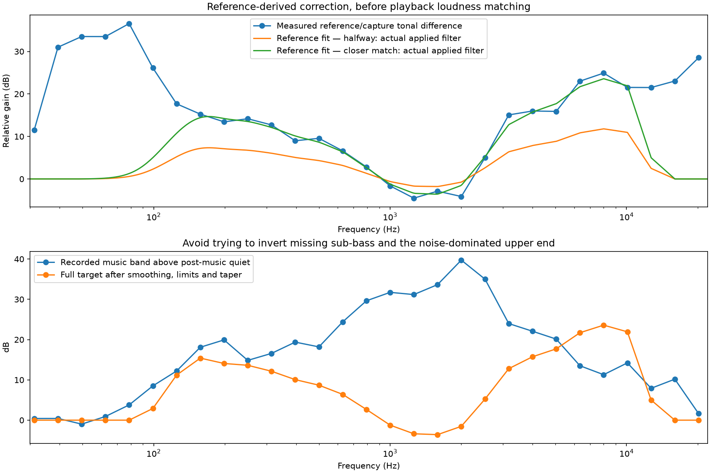

# Reference-derived EQ and logged-quality comparison

Both listening reports now begin with **Logged equivalent — 16 kHz AAC, 32 kbps**, followed by Original. This uses the same native 48 kHz recording, reduced to 16 kHz mono and AAC-encoded at 32 kbit/s before decoding for embedded playback. Constant gain matches playback loudness. It approximates the current Connect/video format, not the exact device resampler/encoder, and does not simulate old firmware clicks. Raw rlogs use PCM; qlogs have no audio. Production micd still defaults to 16 kHz: native 48 kHz here is experimental capture.

The reference-fit report compares Original, gentle EQ with its bass cut removed, half/full strength reference-derived EQ, and the separate stereo reference source. All six clips are 45 seconds, loudness-matched within 0.02 LU, with at least 3 dB measured true-peak headroom. No source audio is mixed into the processed microphone clips.

The fit uses aligned average spectra, one-third-octave smoothing, a 500–2000 Hz level anchor, and a centered 2049-tap FIR. Positive correction is limited to 24 dB, attenuated where the capture approaches background noise, and tapered away below 90 Hz and above 14 kHz. This describes one iPhone + room + enclosure + microphone capture, not an exact microphone calibration. It cannot reconstruct missing content, and boosts also amplify noise. Real-time suitability and perceptual preference remain unvalidated.

User feedback: both earlier EQs reduced boom; gentle EQ removed slightly too much bass. The earlier synthetic version was close to the user's favorite but sounded airy/shallow and changed vocal timbre. These new reference-fit variants use no harmonic synthesis or denoising.

[Self-contained reference-fit listening report](reports/reference-eq.html) · [Clarity and synthesis report](reports/clarity-comparison.html) · [Measurements](metrics/reference-eq.json)
